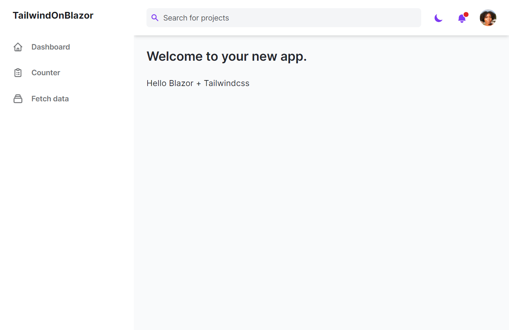
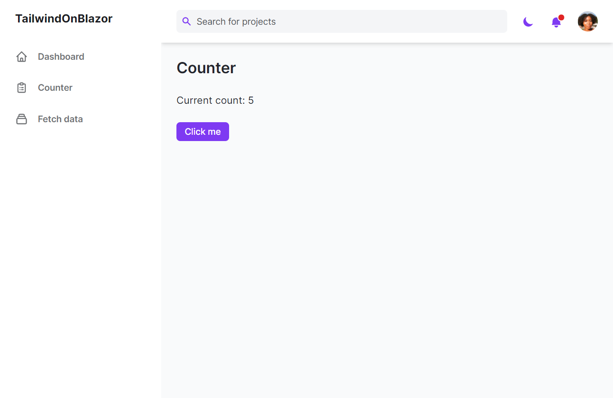
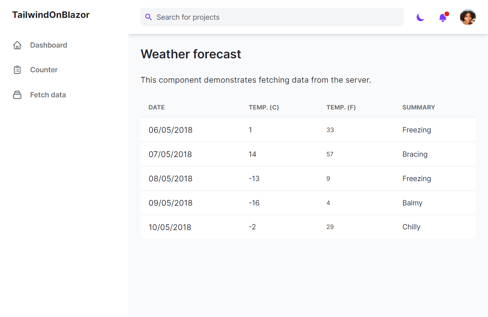
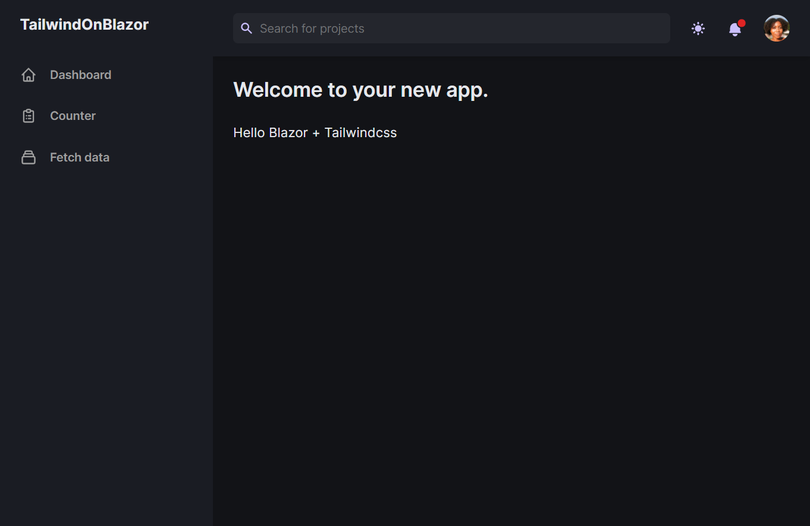
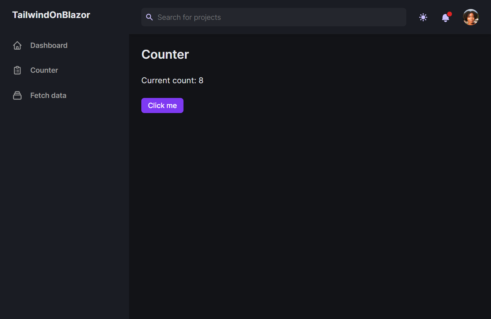
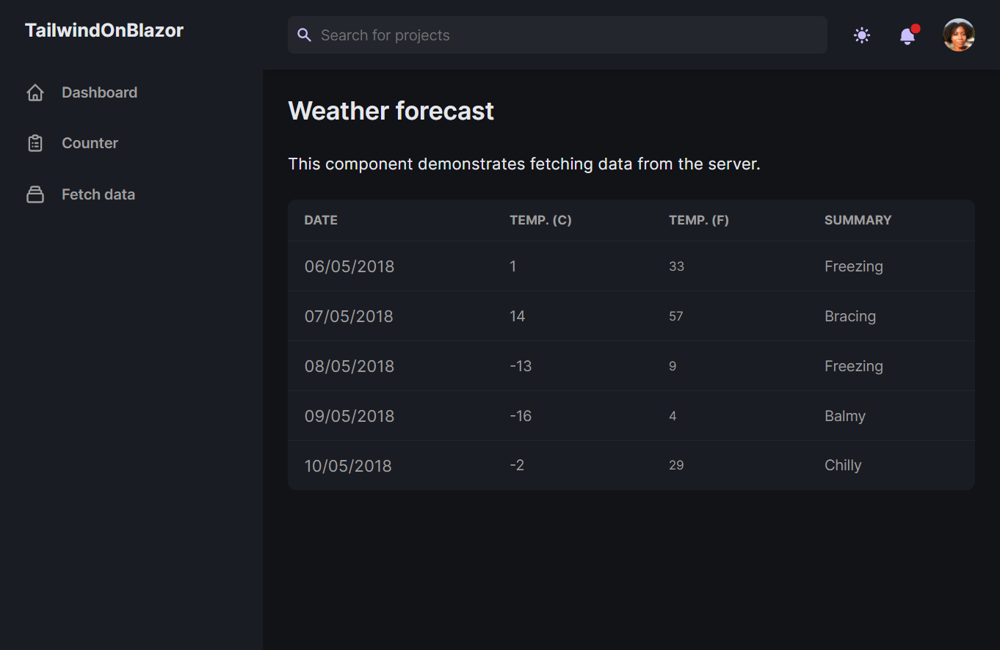

# tailwindonblazor-template

Makes Tailwind works with Blazor

# Give a star ⭐

If you're using this repository for your learning, samples, workshop, or your project, please give a star. Thanks :+1:

# Get starting

```
$ npm install
$ dotnet watch //livereload mode
```

# Some screens

## Normal mode







## Dark mode







# What we use

- npm: 6.14.11
- node: v15.5.1
- .NET 6: 6.0.100-preview.4.21255.9
- Tailwindcss: 2.1.3
- postcss: 8.3.0
- HTML Template: https://github.com/estevanmaito/windmill-dashboard

Happy hacking!